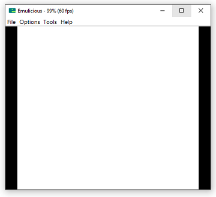
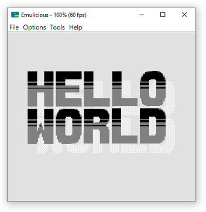

[back](/)

# Post #2 - Understanding the *'Color'* in Game Boy Color

From coding for the classig Game Boy (DMG), I had a somewhat good understanding on how tiles, backgrounds, sprites, the palette and all that works,
but to make the next step on utilizing the GBC, I had three problems right from the start:

- I couldn't get the assembler to produce a usable cartridge file (even if I just copy-pasted a very simple cartridge)
- First, I had only used [GBDK](https://github.com/gbdk-2020/gbdk-2020) so far, which does most of the musclework for you in highlevel C and so I had to find a good source of example code in assembly
- I did not quite understand on how the GBC color palettes work

In the end it turned out that things are way easier than I thought. The problem was mainly in front of the screen and I had just made some wrong assumptions in the first place, but I'll describe my situation in the next few sentences.

## The Game Boy Color *'Mode'*

I knew that the DMG and GBC are very much the same system, at least when it comes to assembler and that the GBC is capable of running old DMG games, so I started my journey at the [GB ASM Tutorial](https://gbdev.io/gb-asm-tutorial/) from gbdev.io.
The `Hello World!` example they use is pretty straight forward and should work right away, unfortunately I was unable to get it running on my system. All I got was a white screen in Emulicious.



At some point I did exactly what was written in the tutorial - including the command line commands - and to my surprise, ended up with a working cartridge.
So I must have definitely missed out on something! I then copy pasted the exact assembler to my project and... again, a white screen!
Ok, so the only difference now were the flags of the build commands. I commented out every single one and eventually found the one that was causing me all this trouble: `--color-only` or short `-C` for **rgbfix**.
After removing it, I was greeted with a nice working cartridge... cool! But whats the issue here?
When I wrote the makefile, I thought that this flag could cause no harm since I was only going to support the GBC anyways, but this assumption seems to be wrong. 
So maybe let's have a look on what will change in the final cartridge when I use this flag.
Interestingly the only thing that changes is a single byte at file-offset 0x143: With `-C` it is 0xC0 and without it is 0x00.
Well... looking back at the [descripton of rgbfix](https://rgbds.gbdev.io/docs/v0.6.0/rgbfix.1/) that's exactly what is supposed to happen. 
But whats the deal with that?
Well, to make a long story short, there are different boot roms for the DMG and GBC. When you run on a GBC (or tell the emulator to act as one), it checks for this particular byte in the header and sets the GBC-palettes to all white. Moreover it will enable the DMG compatibility mode if the value is 0x80 (you can set this by using flag `--color-compatible` or `-c`).

You can read more on that in the [Pan Docs](https://gbdev.io/pandocs/Power_Up_Sequence.html#compatibility-palettes).

So finally that means if you set the cartridge byte 0x143 to 0x80 or 0xC0 it runs in DMG compatibility mode or in GBC-only mode, but in both cases gets its palette data from the GBC paletes which - at that point - are set to white and thus a white screen should be normal. A value of 0x00 seems to make no sense, but I guess in that case most emulators fall back to normal DMD operation and thus the DMG palette works in that case.
Anyways, I should be able to see the tiles again, if I simply set the palette color to anything else, right? Time to dive into the GBC palettes.


## The Game Boy Color palettes

Again, the [Pan Docs](https://gbdev.io/pandocs/Palettes.html#lcd-color-palettes-cgb-only) have a good overview about the different palettes. The only thing I did not quite understand when reading it first was, how does the Game Boy select, if it wants to use the `BGB`, `OBP0` and `OBP1` register for coloring the tiles/sprites or if it shall use the GBC method.
But with the information I gathered about the [0143 - CBG Flag](https://gbdev.io/pandocs/The_Cartridge_Header.html#0143--cgb-flag) I think I can finally put 1 and 1 together and repair the Hello World from the [GB ASM Tutorial](https://gbdev.io/gb-asm-tutorial/).
So all we need to do is write an equivalent of `0b11100100` (the default DMB palette) to the first GBC-palette right?
If I understand the method correctly, the following needs to be done to do so:

- Get an equivalent RGB color for the original black/darkgrey/lightgrey/white colors: 0xffffff, 0xaaaaaa, 0x555555 (more on that later)
- Point the `BGPI` register to the bytes we want to write to
- Write the data using the `BGPD` register

Unfortunately, the GBC does not use the 'modern' 32-Bit RGB values we all know, but has a reduced 5-Bit per color version, called RGB555. So we siply scale the desired `(255,255,255)` `(170,170,170)` `(85,85,85)` `(0,0,0)` down to `(31,31,31)` `(21,21,21)` `(10,10,10)` `(0,0,0)` and get `0x7fff` `0x56b5` `0x294a` `0x0000`. The 15th bit (MSB) is left unused.
Since the GBC is a little endian machine, we need to write `0x00 0x00 0x4a 0x29 0xb5 0x56 0xff 0x7f` to the memory.

So the (very explicit) assembler should look like this:

```nasm
; Color 1

ld a, $00
ldh [rBGPI], a

ld a, $00
ldh [rBGPD], a

ld a, $01
ldh [rBGPI], a

ld a, $00
ldh [rBGPD], a

; Color 2

ld a, $02
ldh [rBGPI], a

ld a, $4a
ldh [rBGPD], a

ld a, $03
ldh [rBGPI], a

ld a, $29
ldh [rBGPD], a

; Color 3

ld a, $04
ldh [rBGPI], a

ld a, $b5
ldh [rBGPD], a

ld a, $05
ldh [rBGPI], a

ld a, $56
ldh [rBGPD], a

; Color 4

ld a, $06
ldh [rBGPI], a

ld a, $ff
ldh [rBGPD], a

ld a, $07
ldh [rBGPI], a

ld a, $7f
ldh [rBGPD], a
```

And indeed, this is what we get:



Adjusted [hello-world.asm](media/p1_hello-world-1.asm) (make sure to use latest hardware.inc and add `-C` flag to rgbfix)

## How to use the palette registers correctly

Always re-setting the `BGPI` register is not a good idea, since it costs many CPU cycles. Luckily Bit 7 of the register can be used to put it in auto-increment mode. With this it will increment for every write to `BGPD` automatically.

So in a first step, the code can be reduced to:

```nasm
; Set Bit 7 to 1: auto increment
ld a, $80
ldh [rBGPI], a

; Color 1

ld a, $00
ldh [rBGPD], a

ld a, $00
ldh [rBGPD], a

; Color 2

ld a, $4a
ldh [rBGPD], a

ld a, $29
ldh [rBGPD], a

; Color 3

ld a, $b5
ldh [rBGPD], a

ld a, $56
ldh [rBGPD], a

; Color 4

ld a, $ff
ldh [rBGPD], a

ld a, $7f
ldh [rBGPD], a
```

In most cases the color values are not hard-coded but are stored as consecutive bytes in the ROM. Together with the auto-increment of the `hl`-register you can write the following minimalicstic code:

```nasm

; Put palettes in ROM
SECTION "palettes", ROM0
Palette0: DB $00, $00, $4a, $29, $b5, $56, $ff, $7f

; ... in your code

; number of bytes
ld c, 8

; Set Bit 7 to 1: auto increment
ld a, $80
ldh [rBGPI], a

; Load adress of palette data
ld hl, Palette0

load_palette:
    ld a, [hli]
    ldh [rBGPD], a
    dec c
    jr nz, load_palette

```

For sprites (or objects as they are sometimes called) it's the same trick, just use `OBPI` and `OBPD` registers instead.

[back](/)

[prev: Motivation](/posts/p2)